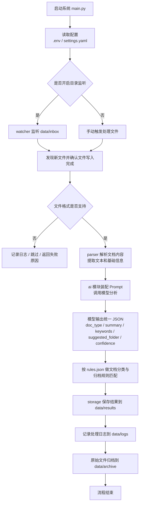

```mermaid
flowchart TD
    A["启动系统 main.py"] --> B["读取配置
.env / settings.yaml"]
    B --> C{"是否开启目录监听"}
    C -->|是| D["watcher 监听 data/inbox"]
    C -->|否| E["手动触发处理文件"]
    D --> F["发现新文件并确认文件写入完成"]
    E --> F
    F --> G{"文件格式是否支持"}
    G -->|否| H["记录日志 / 跳过 / 返回失败原因"]
    G -->|是| I["parser 解析文档内容
提取文本和基础信息"]
    I --> J["ai 模块装配 Prompt
调用模型分析"]
    J --> K["模型输出统一 JSON
doc_type / summary / keywords / suggested_folder / confidence"]
    K --> L["按 rules.json 做文档分类与归档规则匹配"]
    L --> M["storage 保存结果到 data/results"]
    M --> N["记录处理日志到 data/logs"]
    N --> O["原始文件归档到 data/archive"]
    O --> P["流程结束"]

```